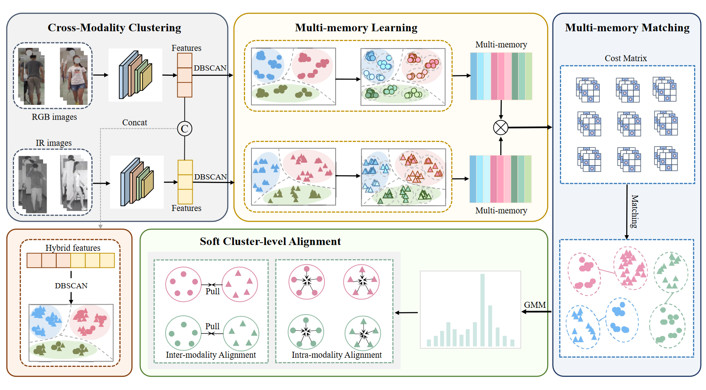

<p align="center">
  <h1 align="center">MMM: Multi-Memory Matching for Unsupervised Visible-Infrared Person Re-Identification</h1>
  <p align="center">
    <a href="https://scholar.google.com/citations?user=Go9q2jsAAAAJ&hl=zh-CN&oi=sra" rel="external nofollow noopener" target="_blank"><strong>Jiangming Shi</strong></a>
    ·
    <a href="https://scholar.google.com/citations?hl=zh-CN&pli=1&user=H1rqfM4AAAAJ" rel="external nofollow noopener" target="_blank"><strong>Xiangbo Yin</strong></a>
    ·
    <a href="" target="_blank"><strong>Yeyun Chen</strong></a>
    ·
    <a href="https://scholar.google.com/citations?user=a-I8c8EAAAAJ&hl=zh-CN&oi=sra" target="_blank"><strong>Yachao Zhang</strong></a>
    ·
    <a href="https://scholar.google.com/citations?user=CXZciFAAAAAJ&hl=zh-CN&oi=sra" rel="external nofollow noopener" target="_blank"><strong>Zhizhong Zhang</strong></a>
    ·
    <a href="https://scholar.google.com/citations?user=RN1QMPgAAAAJ&hl=zh-CN&oi=sra" rel="external nofollow noopener" target="_blank"><strong>Yuan Xie*</strong></a>    
    ·
    <a href="https://scholar.google.com/citations?user=idiP90sAAAAJ&hl=zh-CN&oi=sra" rel="external nofollow noopener" target="_blank"><strong>Yanyun Qu*</strong></a>       
  </p>
<p align="center">
  <a href="https://arxiv.org/pdf/2401.06825" rel="external nofollow noopener" target="_blank">Access the research paper here</a>


This is an official code implementation of "MMM: Multi-Memory Matching for Unsupervised Visible-Infrared Person Re-Identification".

## Requirements
```bash
# Install the required packages
pip install torch==1.8.0 torchvision==0.9.1+cu111 faiss-gpu==1.6.3 scikit-learn==1.3.2
```

## Train/Test Instructions
```bash
# Training Steps for SYSU-MM01

# Step 1: Obtain Features and Pseudo-Labels from Baseline Model
CUDA_VISIBLE_DEVICES=0,1 python Baseline_sysu.py --data-dir dataset_path

# Step 2: Train the MMM Model
CUDA_VISIBLE_DEVICES=0 python main.py --data-dir dataset_path --resume_net1 save_model_name

# Testing for SYSU-MM01
CUDA_VISIBLE_DEVICES=0 python main.py --data-dir dataset_path

```

## Citation
If our work is helpful for your research, please consider citing:
```
@article{shi2024multi,
  title={Multi-Memory Matching for Unsupervised Visible-Infrared Person Re-Identification},
  author={Shi, Jiangming and Yin, Xiangbo and Chen, Yeyun and Zhang, Yachao and Zhang, Zhizhong and Xie, Yuan and Qu, Yanyun},
  journal={arXiv preprint arXiv:2401.06825},
  year={2024}
}


@inproceedings{shi2023dpis,
  title={Dual pseudo-labels interactive self-training for semi-supervised visible-infrared person re-identification},
  author={Shi, Jiangming and Zhang, Yachao and Yin, Xiangbo and Xie, Yuan and Zhang, Zhizhong and Fan, Jianping and Shi, Zhongchao and Qu, Yanyun},
  booktitle={Proceedings of the IEEE/CVF International Conference on Computer Vision},
  pages={11218--11228},
  year={2023}
```


## Contact
jiangming.shi@outlook.com; xiangboyin@stu.xmu.edu.cn.

## Acknowledgements
The code is implemented based on [ADCA(ACMMM2022)](https://github.com/yangbincv/ADCA), [PGM(CVPR2023)](https://github.com/zesenwu23/USL-VI-ReID). We sincerely thank all researchers for their high-quality works.
